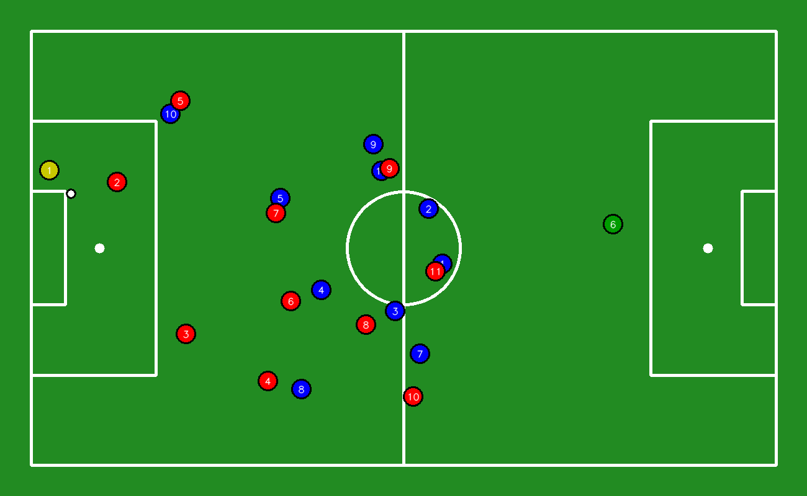
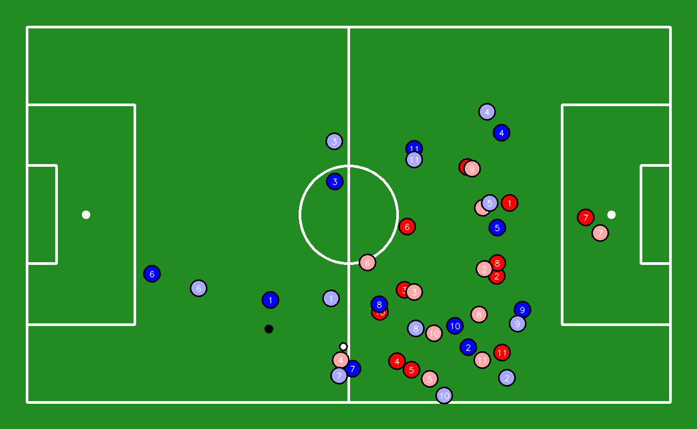
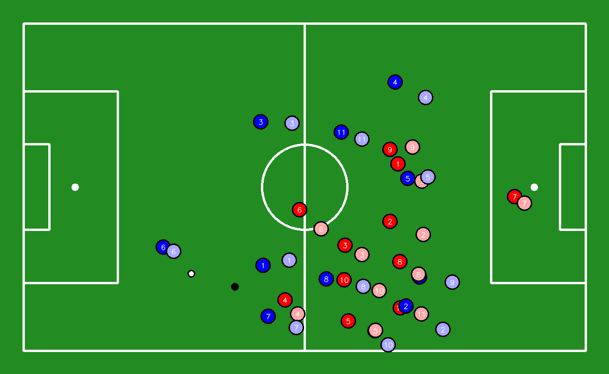

# VirtIAFut

Objective: explore how Artificial Intelligence/Machine Learning can be effectively used to predict the movement of players and the ball in order to improve the accuracy of element virtualization.

How to run:

```
pip install -r requirements.txt --index-url https://download.pytorch.org/whl/cpu --extra-index-url https://pypi.org/simple
```

**NOTEBOOKS**

detections:

* bytetracker - tests with the ByteTracker for a video with team assignment and gk association and video with keypoint detection
* detections_tracking - implementation of the detection,tracking,team assignment, gk association , keypoint detection, save coordinates, transformation of the coordinates to a 2D plane
* data_preparation - manual mapping of the player IDs, data interpolation
* elements_presentation - test with the draw functions used later for virtualization

predictions:

- lstm - implementation of the LSTM model
- transformer - implementation of the TF model
- data_preparation - some data preparation for the output of the models (save one dataset with x and y combined and save one dataset with separate x and y)
- tf_metrics - metrics of the TF model

data_visualization:

- virtualization-lstm-comparison - implementation of the virtualization for the comparison of the LSTM vs Real Data
- virtualization-tf-comparison - implementation of the virtualization for the comparison of the TF vs Real Data
- virtualization - implementation of the virtualization for Real Data

**MODELS**

Players and Ball Detection: https://universe.roboflow.com/roboflow-jvuqo/football-players-detection-3zvbc/model/2

Keypoints Detection: https://universe.roboflow.com/roboflow-jvuqo/football-field-detection-f07vi/model/14

**Current Results of Predictions**

Real Data - with Linear Interpolation



Transformer



LSTM


