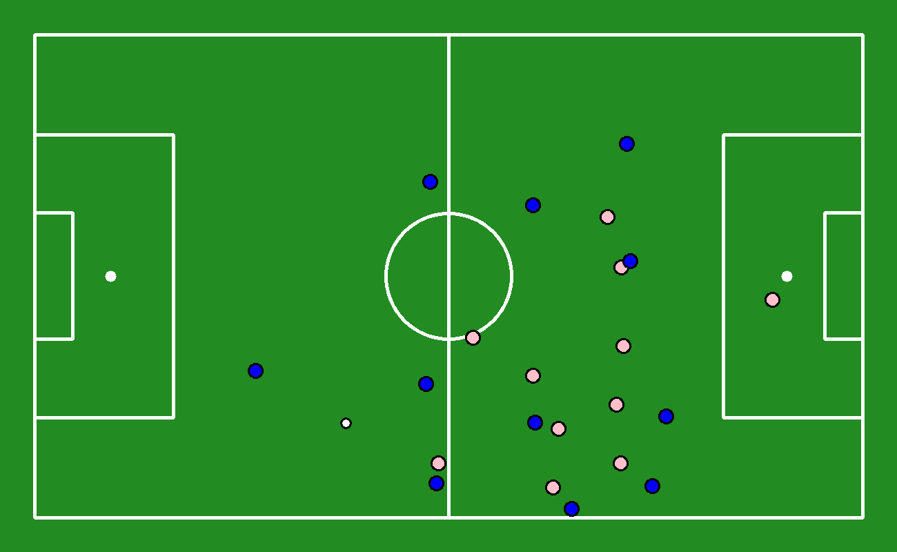
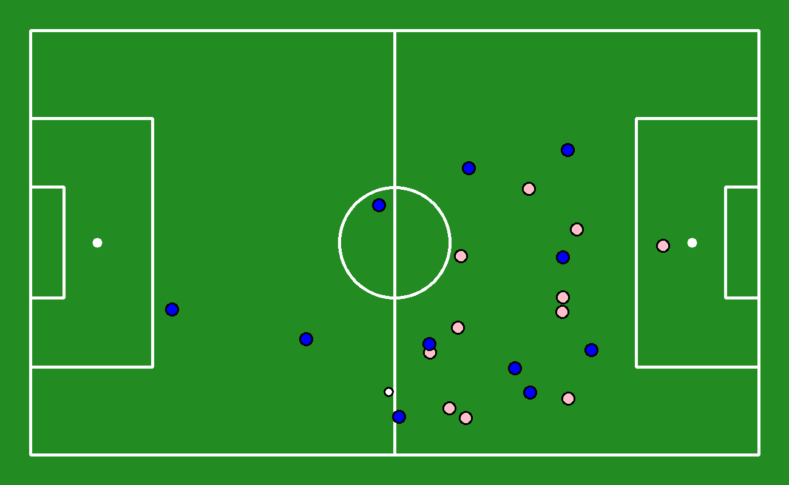
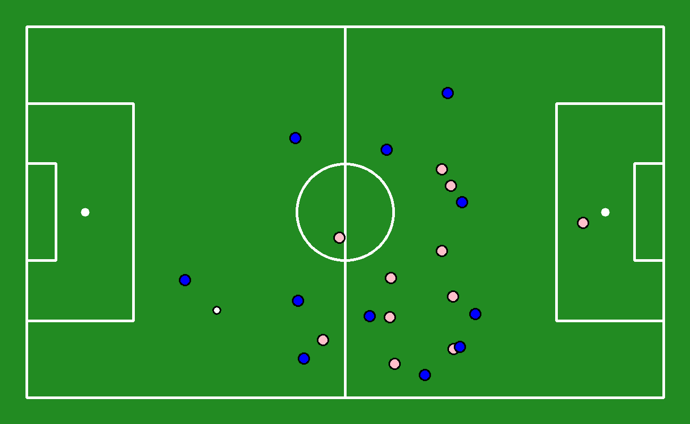

# VirtIAFut

Objective: explore how Artificial Intelligence/Machine Learning can be effectively used to predict the movement of players and the ball in order to improve the accuracy of element virtualization.

How to run:

```
pip install -r requirements.txt --index-url https://download.pytorch.org/whl/cpu --extra-index-url https://pypi.org/simple
```

**Video of Detections Tracking**

**Current Results of Predictions**

Real Data - with Linear Interpolation



Transformer



LSTM


